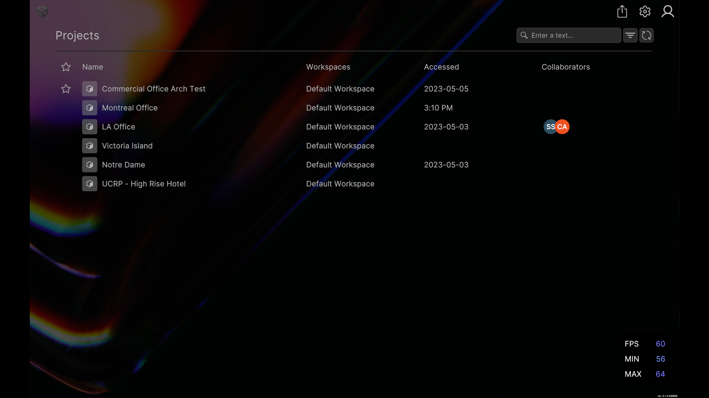
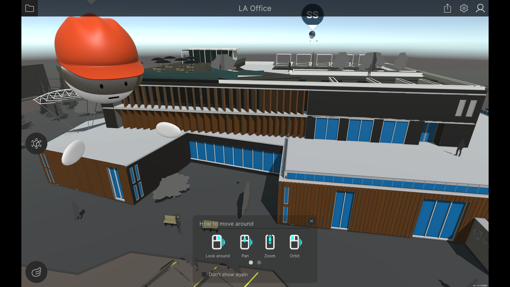

# Unity Reference Project

  

## A Unity project for building a collaborative 3D design review tool

> **Important**: Unity Reference project is an experimental project. For early access, contact your Unity Sales partner.

The Unity Reference Project is a fully functional collaborative design review tool for 3D assets. It's a Unity project that you can build on to create your own custom viewer application. It also lets you take advantage of any improvements that Unity publishes to GitHub.

## Get support

To connect and find support, join the [Unity forum](https://forum.unity.com/forums/unity-cloud.868/).

### Supported platforms and files

The Unity Reference Project is compatible with the [latest Unity Long Term Support](https://unity.com/releases/2021-lts) (LTS)  and tested on the following platforms:

- Windows
- MacOS
- iOS
- Android
- WebGL
- Tethered VR headsets

It supports the following file formats: `.3dm`, `.3ds`, `.3dxml`, `.asm`, `.catpart`, `.catproduct`, `.cgr`, `.dae`, `.dwg`, `.dxf`, `.fbx`, `.gds`, `.glb`, `.gltf`, `.iam`, `.ifc`, `.igs`, `.iges`, `.ipt`, `.jt`, `.neu`, `.nwc`, `.nwd`, `.obj`, `.par`, `.plmxml`, `.prc`, `.prt`, `.psm`, `.pvs`, `.pvz`, `.pxz`, `.pwd`, `.rfa`, `.rvt`, `.rvm`, `.sab`, `.sat`, `.sldasm`, `.sldprt`, `.step`, `.stepx`, `.stepz`, `.stl`, `.stp`, `.stpx`, `.stpxz`, `.stpz`, `.u3d`, `.usd`, `.usda`, `.usdc`, `.usdz`, `.vda`, `.vrml`, `.wrl`, `.xas`, `.xpr`.

## Contents

- [Unity Reference Project](#unity-reference-project)
  - [A Unity project for building a collaborative 3D design review tool](#a-unity-project-for-building-a-collaborative-3d-design-review-tool)
  - [Get support](#get-support)
    - [Supported platforms and files](#supported-platforms-and-files)
  - [Contents](#contents)
  - [Overview](#overview)
  - [Get the project](#get-the-project)
  - [Configure Unity services](#configure-unity-services)
    - [Sign into your Unity account](#sign-into-your-unity-account)
    - [Create an ID for your application](#create-an-id-for-your-application)
      - [Set the App Id in the Unity Editor](#set-the-app-id-in-the-unity-editor)
    - [Upload assets to review](#upload-assets-to-review)
  - [Open the project for the first time](#open-the-project-for-the-first-time)
  - [Run the project](#run-the-project)
    - [View 3D assets](#view-3d-assets)
    - [Manage assets](#manage-assets)
  - [Troubleshooting](#troubleshooting)
    - [You can't stream your asset](#you-cant-stream-your-asset)
  - [Bugs](#bugs)
  - [License](#license)
  - [Tell us what you think!](#tell-us-what-you-think)

## Overview

The Unity Reference Project is a Unity project intended to be used as a starting point for building a collaborative 3D asset review tool. It can be built for many platforms, including WebGL, making it highly accessible and simple to share. The Unity Reference Project is designed to be highly customizable so you can add, remove, or change its features, tools, and UI; while still being able to pull in the latest updates with minimal conflicts.

This project features Unity services that make it easier to:

- Authenticate with your Unity account.
- List and select an asset from cloud storage.
- Stream a large 3D asset from cloud storage (vast support for 3D formats).
- Collaborate online with voice chat and user avatars.
- Share a deep-link to an asset for others to view.

It also lets you customize your application. For example, you can:

- Customize navigation modes.
- Localize your application.
- Add a view that you can toggle to troubleshoot performance.
- Customize the user interface and tools.
- Add and customize tools for VR.

## Get the project

* To get the Reference project, you can clone or download it.

## Configure Unity services

Configuring Unity services typically involves signing into your Unity account and registering your application.

### Sign into your Unity account

* To sign in, go to the [Asset Manager](https://dashboard.unity3d.com/digital-twins/).

### Create an ID for your application

For your application to function effectively with Unity streaming services and deep linking, you must first create an App Id.

> **Important**: If you do not set an App Id, your project will fail to build.

To create an `App Id`, follow these steps:

1. Log into the [Asset Manager](https://dashboard.unity3d.com/digital-twins/).
2. Select **Developer Hub** > **Registered Applications**.
3. Select the **+ Register an application**.
4. Enter the application name in the **App Name** field.
5. (Optional) Add a description for your application in the **Description** field.
6. Select **Create**.
7. Copy your `App Id` to your clipboard.

#### Set the App Id in the Unity Editor

To use the `App Id`, follow these steps:

1. Open the Unity Reference Project in the Unity Editor.
2. Go to **Edit > Project Settings > Unity Cloud > App Registration**.
3. Paste your `App Id` in the **App Id** field.
4. Select **Refresh** to update the application data in the Unity Cloud Portal.

### Upload assets to review

Before you can view assets in the Unity Reference Project, you must upload them to the portal.

To access assets in a different organization, change organizations in the upper-right of the dashboard page.

To upload an asset:

1. In the [Asset Manager](https://dashboard.unity3d.com/digital-twins/), select **+ New**.
2. Name the asset.
3. Drag your 3D asset and its dependent files into the upload area.
4. Select **Create**.

Once the asset finishes processing, you can stream through the Unity Reference Project.

## Open the project for the first time

Once you have downloaded the project, follow these steps:

1. Check that you have installed the [2021 LTS Unity Editor](https://unity.com/releases/2021-lts).
2. To add the project to the Unity Hub, select **Open**.
3. Select the folder called **ReferenceProject** in the downloaded repository.

> **Note**: The first time you open the project, Unity will import all assets, including packages it depends on, which will take longer than usual.

4. [Set your App Id](#create-an-id-for-your-application).
5. Open the `Main` scene (`Assets/_Application/Scenes/Main.unity`).

## Run the project

After you run the `Main` scene, you must sign in.

### View 3D assets

1. To open an asset in the viewer, select it from the list.
2. (Optional) To move the camera, you can do any of the following:
   - select
   - touch
   - drag-and-drop
   - zoom in and out
   - scroll
   - pinch
  To change the navigation mode, select the icon in the lower-left corner.

### Manage assets

1. To return to your asset list, select the folder icon in the upper-left corner.
2. If you need to access personal settings, select the cog icon in the top-right corner. From there, you can change between English and French localization or toggle the display of frame rate information.
3. To sign out of your Unity account, select the avatar icon in the upper-right corner.

## Troubleshooting

### You can't stream your asset

To correctly stream your asset, you need to [set your App Id](#create-an-id-for-your-application).
  
## Bugs  

Report bugs in the Unity Reference Project using GitHub Issues. Report Unity Editor bugs using the [Unity bug submission process](https://unity3d.com/unity/qa/bug-reporting).
  
## License

For legal information or third-party license information, see [LICENSE.md](LICENSE.md).

## Tell us what you think!

Thank you for taking a look at the project! To help us improve and provide greater value, please consider providing [feedback on our forum](https://forum.unity.com/forums/unity-cloud.868/) about your experience with the Unity Reference Project. Thank you!
