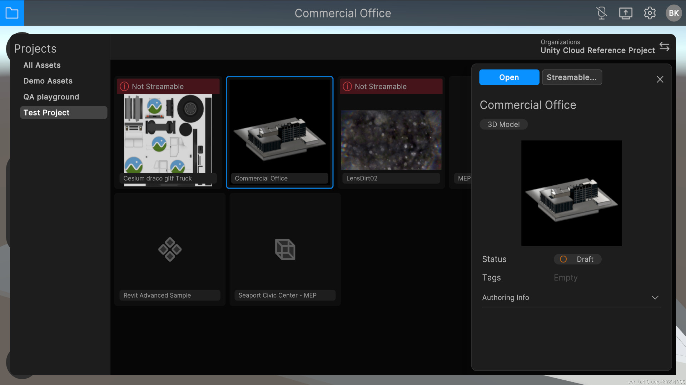
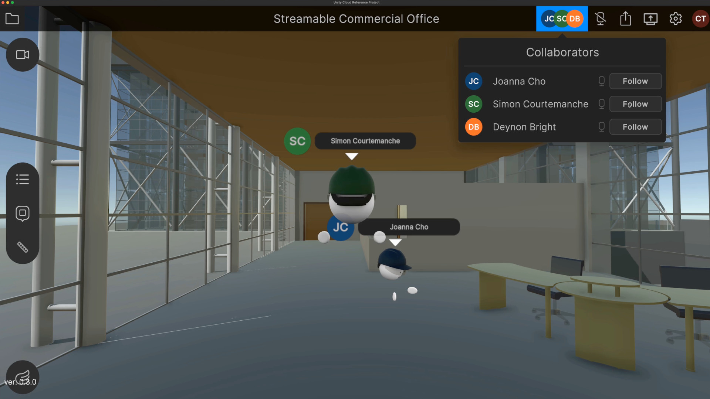
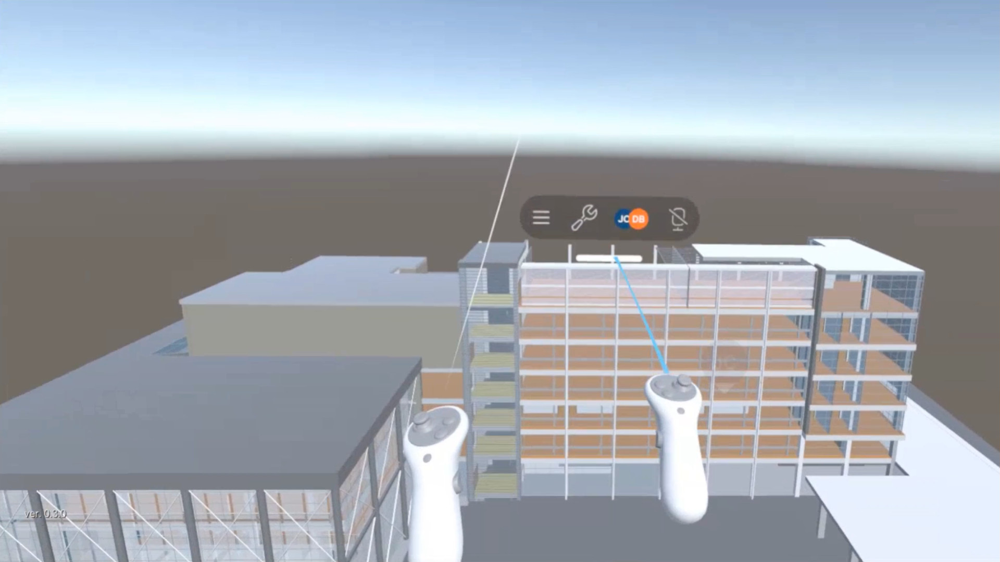
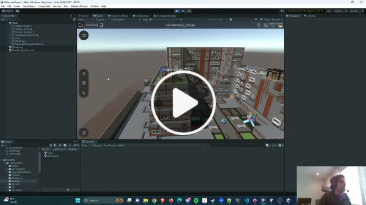

# Unity Cloud Reference Project

  

## A Unity project for building a collaborative 3D design review tool

> **Important**: Unity Cloud Reference project is an experimental project. For early access, contact your Unity Sales partner.

The Unity Cloud Reference Project is a fully functional collaborative design review tool for 3D assets. It's a Unity project that you can build on to create your own custom viewer application. It is actively developed and built so that you can easily upgrade to get improvements and new features Unity publishes to GitHub.

## Getting Started Video

## Contents

- [Unity Cloud Reference Project](#unity-cloud-reference-project)
  - [A Unity project for building a collaborative 3D design review tool](#a-unity-project-for-building-a-collaborative-3d-design-review-tool)
  - [Contents](#contents)
  - [Overview](#overview)
    - [Customize](#customize)
    - [Integrate with Unity Cloud](#integrate-with-unity-cloud)
  - [Documentation](#documentation)
  - [License](#license)
  - [Tell us what you think!](#tell-us-what-you-think)

## Overview

Software vendors creating custom industrial applications repeat similar steps to get started:

1. Create a Unity application
2. Build a 3D asset ingestion pipeline
3. Optimize for large models
4. Add collaborative tools
5. Add AR & VR functionality, etc.

This is expensive and takes away time they could be spending developing their unique value proposition targeted towards their industry or use case.

The Unity Cloud Reference Project is a Unity project intended as a starting point for industry developers, and is architected with customization and extensibility in mind. Developers can pull in changes from the latest release with minimal conflicts to their codebase and can easily remove unwanted features. It supports many build targets, empowering users to easily share their 3D assets for review.

### Customize

- Navigation modes (users can toggle between walk, fly, teleport, VR, or your own custom modes)
- Localization to support multiple languages in the user interface
- Tools and user interface elements (add, remove, and completely modify)
- Tools to support VR applications, such as virtual keyboards and other world-space user interfaces

### Integrate with Unity Cloud

- Authenticate with your Unity account or SSO
- Browse and view your 3D assets from the Unity Asset Manager
- Stream large 3D assets (skyscrapers, offshore drilling, cities) of vast 3D formats
- Collaborate online with multiuser avatars and voice chat
- Annotate your 3D assets with topics, threads, comments, and attachments

## Documentation

For a deep dive into the Unity Cloud Reference Project, visit our [documentation site](https://docs.unity.com/cloud/en-us/creator-sdks/reference-project).

## License

For legal information or third-party license information, see [LICENSE.md](LICENSE.md).

## Tell us what you think!

Thank you for taking a look at the project! To help us improve and provide greater value, please consider providing [feedback on our forum](https://forum.unity.com/forums/unity-cloud.868/) about your experience. Thank you!
