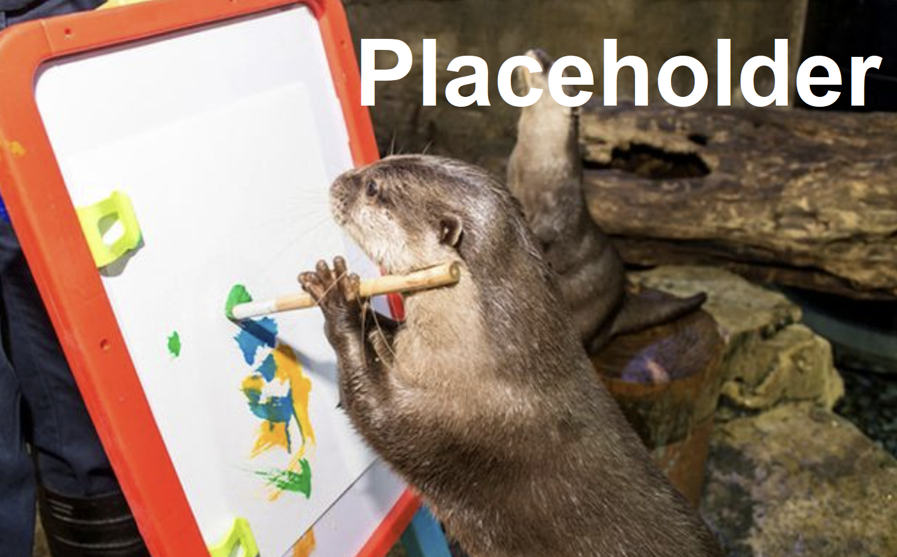

# My Unity Cloud Platform Sample Project
Introduce your sample project and explain what it is intended to help users understand and accomplish. It can be helpful to link from this paragraph to sections of Unity Editor Manual documentation with information that is outside the scope of your project, but still relevant.

After reading your introduction, a user should know whether or not your sample project is relevant or interesting to them.

Helpful questions you can use for writing prompts include:

* Why would someone want to play with your sample project?
* What is it supposed to demonstrate?
* Who is it supposed to be super interesting to?
* Which pain points or unintuitive parts of your feature does the sample project show users how to get through?
* What can users gain from their experience with your sample project?
* Prerequisites and system requirements
* What does a user need to have before they can install and use your sample project? For example, do they need a:
	* Special license
	* Particular version of the Unity Editor
	* Permissions or a particular type of user account with valid credentials
	* Project already set up
	* Set of packages already installed
	* Operating system
	* Graphics card or other hardware
	* Companion animal

## Installation
Describe the basic things a user needs to do to get to a point where they are able to open the sample project without an intimidating number of warnings.

After you summarize the process, write the exact steps for completing installation activities here:

1. Do the first thing.
2. Do the second thing.
3. Keep it up.
4. (optional) If you really want to, you can do this thing.
5. Validate that you did the thing correctly by doing this.

A successful outcome typically looks like this:

### Troubleshooting your installation

The Unity Editor can be a tricky beast. A lot of things can go wrong. List the most annoying things, and how to fix or work around them.

Now the user is ready to open the project and get started.

## Getting started

This section explains how to open the sample project and start doing cool things with it.

At the end of this section, a user should know where everything they need to be successful with your sample is located, and be ready to try out your features by following workflow procedures.

### Opening the sample project

Explain how to open the project.

### Verifying project settings

Are there any project or editor settings that the user needs to modify or verify before they can do cool stuff?

### Identifying new content
Tell me:

* What new things can they see that they haven’t seen before?
* What’s different about the Hierarchy in this sample?
* What assets are in the sample that they should pay attention to?
* Are there special scripts that you used to make the sample functional?

## Do the first interesting thing!

How do they do the first interesting thing that they can with your project? Write specific steps and describe the successful outcome.

## Do another interesting thing!

You can see where this is headed.  Write specific steps and describe the successful outcome.

## Wait! There is another interesting thing that you can do!!

Write specific steps and describe the successful outcome.

## Going further

If you want to give them ideas for ways to extend existing functionality in the sample project, you can write about them here!! Go crazy!!

## Troubleshooting

This section describes issues you might have while using the sample.

## UI issues
Any issues related to the UI. For example:

**I can't change the color of my image.**

Install the HDRP package.

## API issues
Any issues related to the API. For example:

**I get an error when I make a specific call.**

You must make a different call first.

## System issues
Any issues related to system requirements.

**I meet the hardware requirements but can't install the package.**

Have you tried turning your computer off and on again?

## Feline issues
Any other absurd issues.

**I can't get my cat into my scene.**

This version of the Unity Editor does not support live animals.
