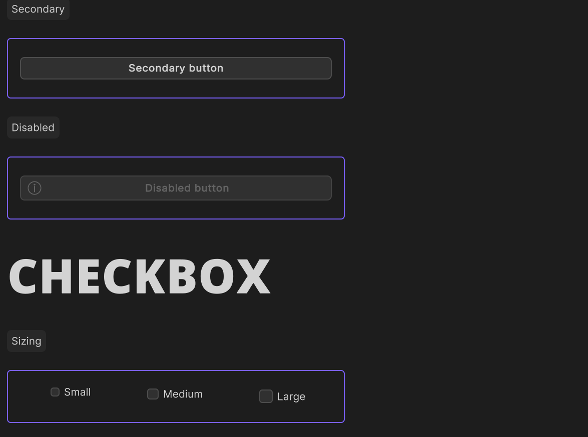

# Accessibility

Accessibility support in game engines can be more complex than other platforms, since there are no universal standards for
how to implement accessibility features. However, App UI provides a few features that can help make your UI more accessible to users with disabilities.

## Focus Outline

The focus outline is a visual indicator that shows which UI element is currently focused.
This indicator is only visible when the UI element has been focused via a keyboard navigation.

<p align="center">

</p>

## Keyboard navigation

One key feature for accessibility is keyboard navigation. This feature allows users to navigate through UI elements using the tab and shift+tab keys.
App UI supports keyboard navigation through a defined Focus Ring. When an element is focused, it is outlined with a focus indicator.
This feature is important for users who rely on a keyboard to navigate UIs.

<p align="center">

</p>

To enable keyboard navigation for App UI components, you can use the `focusable` property.
This property determines whether an element can receive focus from the keyboard.
By default, most App UI components are not focusable, so you will need to set this property if you want to enable keyboard navigation.

```csharp
using UnityEngine.Dt.App.UI;

var myButton = new Button();

// Legacy UITK focusable mode, to be navigated with tab key
myButton.focusable = true; 

// New focusable mode for more granular control
myButton.AddManipulator(new KeyboardFocusController(OnKeyboardFocusIn, OnPointerFocusIn, OnFocusOut));
```

## Screen reader and Semantics

> [!IMPORTANT]
> This feature is currently not accessible. 
> It will be available in a future release.

Screen readers are software that reads text aloud to users.
Another important feature for accessibility is semantics. Semantics provide hints, descriptions, and announcements about UI elements,
and are particularly useful for screen readers.
App UI provides some basic semantic properties for defining these hints and descriptions:

- `hint`: A short hint for the user about what the element does or how to interact with it. This is often used for elements that may not be immediately obvious to the user.
- `description`: A longer description of the element, which may include additional details about how it works or what it does.

To use these semantic properties, simply set the appropriate property on the UI element. For example:

```csharp
var myButton = new Button();
myButton.SetSemanticProperty(SemanticProperty.Hint, "Press the button to submit the form.");
myButton.SetSemanticProperty(SemanticProperty.Description, "This button submits the form to the server");
```

By using semantic properties, you can make your UI more accessible to users with disabilities, particularly those who rely on screen readers.

You also have the ability to request that a screen reader announce a message to the user. 
This is useful for providing feedback to the user about the result of an action, or for providing additional information about the current state of the UI. 

To do this, you can use the `Announce` method on the `ScreenReader` class:

```csharp
ScreenReader.Announce("The form has been submitted");
```

Here is a complete example of a UI element that uses semantic properties and screen reader announcements:

```csharp
using UnityEngine.Dt.App.UI;
using UnityEngine.UIElements;
using UnityEngine;

public class MyAccessibilityComponent : VisualElement
{
    private App.UI.Button myButton;
    
    public MyAccessibilityComponent()
    {
        myButton = new App.UI.Button();
        myButton.text = "Click Me!";
        myButton.RegisterCallback<ClickEvent>(OnButtonClick);

        // Define a hint for the button
        myButton.SetSemanticProperty(SemanticProperty.Hint, "Press the button to submit the form.");

        Add(myButton);
    }

    private void OnButtonClick(ClickEvent evt)
    {
        // Announce a message to the screen reader
        ScreenReader.Announce("Button clicked.");
    }
}
```