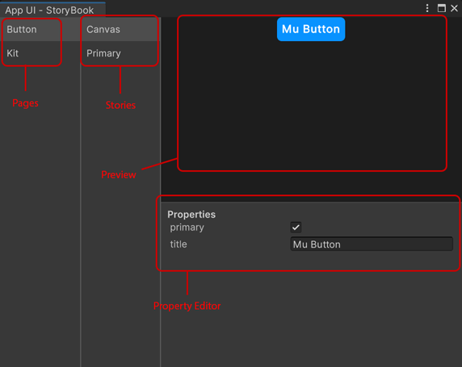

# Storybook

THe Storybook sample demonstrate how to display and test UI components
in the same way as the [React Storybook](https://storybook.js.org/) library.

## Getting Started

### Installation

To use the UI Kit sample, you will need to have this package installed in your project.

To install the package, follow the instructions in the [Installation and Setup](xref:setup)
section of the documentation.

Inside the Unity Package Manager window, select the **Replica App UI** package, then
go to **Samples** and select **Storybook**. Click **Install** to install the sample.

### Usage

The Storybook sample contains only C# classes and scripts. It doesn't contain any scenes.

Our Storybook window is able to collect all the stories from the project and display them in a list.

To open the Storybook window, go to **Window > App UI > Storybook**.

<p align="center">

</p>

On the left side of the window, you will see a list of all the pages that contain stories.
Click on a page to see the list of stories in that page on the second column.

The **Canvas** story is a special story that displays the UI Component with a property editor.
It can be used to edit the properties of the UI Component and see the changes in real time.

Others stories are made directly by code by giving a specific context.

## Creating Stories

First, you need to create a Storybook Page which will contains all the stories of a specific
UI Component.

To create a Storybook Page, create a new C# class that inherits from [StoryBookPage](xref:UnityEngine.Dt.App.Editor.StoryBookPage).

Here is an example of a Storybook Page for the Button UI Component.

```csharp
public class ButtonStoryBookPage : StoryBookPage
{
    public override string displayName => "Button";

    public override Type componentType => typeof(ButtonComponent);

    public ButtonPage()
    {
        // Add stories here using m_Stories.Add()
    }
}

public class ButtonComponent : StoryBookComponent
{
    public override Type uiElementType => typeof(Button);

    public ButtonComponent()
    {
        m_Properties.Add(new StoryBookBooleanProperty(
            nameof(Button.primary),
            (btn) => ((Button)btn).primary,
            (btn, val) => ((Button)btn).primary = val));

        m_Properties.Add(new StoryBookStringProperty(
            nameof(Button.title),
            (btn) => ((Button)btn).title,
            (btn, val) => ((Button)btn).title = val));
    }
}
```

The `displayName` property is used to display the name of the page in the Storybook window.

The `componentType` property is used to display the properties of the UI Component in the Storybook property editor.

You must implement the `componentType` property by creating a new class that inherits from [StoryBookComponent](xref:UnityEngine.Dt.App.Editor.StoryBookComponent).

> [!NOTE]
> If you don't provide a valid `componentType` property, the Storybook property editor 
> and the **Canvas** story will not be displayed.

To add a story, use the `m_Stories.Add()` method.

```csharp
public ButtonPage()
{
    m_Stories.Add(new StoryBookStory("Primary", () => new Button { primary = true, title = "Primary Style Button" }));
    m_Stories.Add(new StoryBookStory("Secondary", () => new Button { title = "Secondary Style Button" }));
}
```
