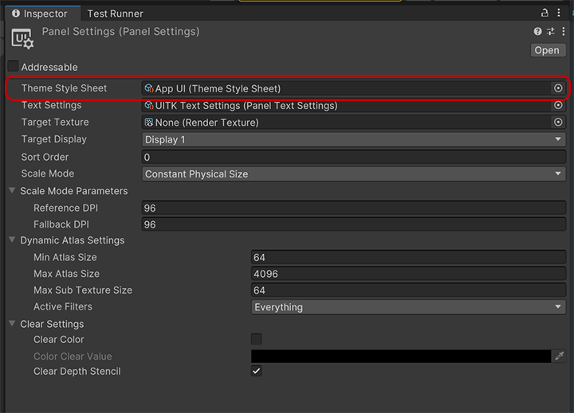
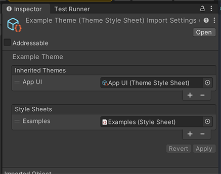
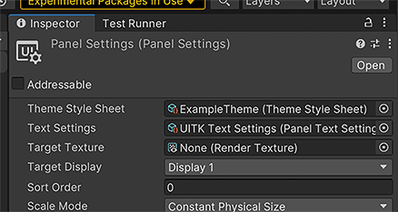

# Theming

The App UI theming system is based on USS variables and provides developers 
the flexibility to customize the look and feel of their applications. 
This system allows you to change colors, font sizes, font families, 
and many other aspects of the user interface without having to modify 
the application's source code.

## Theme files

A theme file is a set of USS variables that defines the colors and styles 
used by the UI elements. These files are usually located in the `PackageResources/Styles/Themes`
directory and have the `.tss` extension. App UI provides a default theme file
called `App UI.tss`
which can be used as a starting point for customizing the theme.

## Using a theme

To apply the custom theme to your application, 
you need to reference this Theme file inside the [PanelSettings](xref:UnityEngine.UIElements.PanelSettings)
used on your [UIDocument](xref:UnityEngine.UIElements.UIDocument) component.

<p align="center">

</p>

## Creating a theme

To create a custom theme, we recommend to create 2 files:
- A Stylesheet file (`.uss`) that will contains all the the theming variables.
- A Theme file (`.tss`) that will reference the stylesheet file.

### Stylesheet file

The stylesheet file will have a set of USS variables that defines the colors and styles.

Here is an example of a stylesheet file for a custom theme named `darkBlue`:

```css
.appui--darkBlue {
    --appui-primary-100: #E3F2FD;
    ...
}
```

> [!IMPORTANT]
> You must use the `appui--` prefix for your theme name, since it
> is used by the App UI context provider to identify the theme.

> [!NOTE]
> If you want a complete override of the default theme, we recommend to
> copy the default theme stylesheet file and modify it.
> The default theme file is `App UI - Dark.class.tss`.

### Theme file

The theme file will reference the stylesheet file and will be used
on the [PanelSettings](xref:UnityEngine.UIElements.PanelSettings) of your
[UIDocument](xref:UnityEngine.UIElements.UIDocument) component.

Here is an example of a theme file for the `darkBlue` theme:

```css
@import url("darkBlue.uss");

VisualElement {}
```

You can also use the Editor inspector panel for editing the theme file:

<p align="center">

</p>

When all the theme files are ready, you can reference the theme file
in the [PanelSettings](xref:UnityEngine.UIElements.PanelSettings) of your
[UIDocument](xref:UnityEngine.UIElements.UIDocument) component:

<p align="center">

</p>


